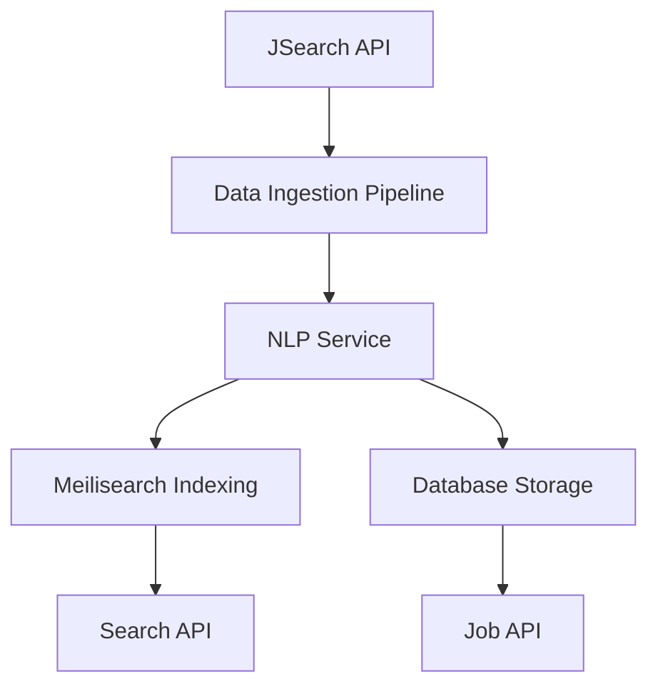

# JobNaut Data Pipeline Documentation

## Overview

The JobNaut data pipeline is responsible for fetching job data from external sources, processing it with AI-powered NLP services, and indexing it for fast search capabilities. This pipeline ensures that job seekers have access to up-to-date and relevant job opportunities.

## Architecture

The data pipeline consists of three main components:

1. **Data Ingestion Service** - Fetches job data from external APIs
2. **NLP Processing Service** - Extracts skills and analyzes job descriptions
3. **Search Indexing Service** - Indexes processed jobs for fast searching

## Data Flow



## Components

### 1. Data Ingestion Pipeline

Location: `src/python/data_pipeline/ingest.py`

The data ingestion pipeline fetches job data from the JSearch API, processes it with NLP services, and indexes it in Meilisearch.

#### Key Features:

- Fetches jobs from JSearch API with configurable queries
- Processes job descriptions with NLP for skill extraction
- Indexes jobs in Meilisearch for fast search
- Handles rate limiting and error recovery

#### Configuration:

- `JSEARCH_API_KEY` - API key for JSearch
- `MEILISEARCH_HOST` - Meilisearch server URL
- `MEILISEARCH_API_KEY` - API key for Meilisearch
- `NLP_SERVICE_URL` - URL for the NLP service

### 2. NLP Processing Service

Location: `src/python/nlp/main.py`

The NLP service uses Hugging Face models to extract skills from job descriptions and classify jobs.

#### Key Features:

- Skill extraction from job descriptions
- Job category classification
- Experience level determination
- Batch processing capabilities

#### Endpoints:

- `POST /extract-skills` - Extract skills from text
- `POST /batch-extract-skills` - Extract skills from multiple texts
- `POST /analyze-job` - Analyze job description with full analysis
- `GET /` - Health check endpoint

#### Configuration:

- `HUGGING_FACE_API_KEY` - API key for Hugging Face Inference API

### 3. Job Service (Backend)

Location: `src/services/jobService.js`

The job service coordinates between external APIs, the NLP service, and the database.

#### Key Features:

- JSearch API integration for job fetching
- NLP service integration for skill extraction
- Meilisearch integration for indexing
- Database operations for job storage
- Job recommendation algorithms

#### Methods:

- `fetchJobsFromJSearch()` - Fetch jobs from JSearch API
- `extractSkillsWithNLP()` - Extract skills using NLP service
- `batchExtractSkills()` - Extract skills from multiple descriptions
- `indexJobsInMeilisearch()` - Index jobs in Meilisearch
- `processAndStoreJobs()` - Process and store jobs in database
- `getJobRecommendations()` - Get personalized job recommendations

## Environment Variables

```env
# JSearch API
JSEARCH_API_KEY=your_jsearch_api_key

# Meilisearch
MEILISEARCH_HOST=http://localhost:7700
MEILISEARCH_API_KEY=your_meilisearch_api_key

# Hugging Face
HUGGING_FACE_API_KEY=your_hugging_face_api_key

# NLP Service
NLP_SERVICE_URL=http://localhost:8000
```

## Running the Pipeline

### 1. Start the NLP Service

```bash
cd src/python/nlp
pip install -r requirements.txt
uvicorn main:app --host 0.0.0.0 --port 8000
```

### 2. Run the Data Ingestion Pipeline

```bash
cd src/python/data_pipeline
python ingest.py
```

### 3. Start the Backend Service

```bash
npm run dev
```

## Testing

The data pipeline includes comprehensive tests:

```bash
# Run all job-related tests
npm test -- --testNamePattern="Job"

# Run specific test suites
npm test tests/services/jobService.test.js
npm test tests/models/job.test.js
npm test tests/api/routers/jobs.test.js
```

## Monitoring and Logging

The pipeline uses structured logging for monitoring:

- Job fetching status
- NLP processing results
- Indexing success/failure
- Error conditions and recovery

## Error Handling

The pipeline includes robust error handling:

- API rate limiting compliance
- Retry mechanisms for transient failures
- Fallback to mock data when services are unavailable
- Graceful degradation of features

## Performance Considerations

- Batch processing for NLP operations
- Connection pooling for database operations
- Caching for frequently accessed data
- Rate limiting compliance with external APIs

## Security

- API keys stored in environment variables
- Input validation and sanitization
- Secure communication with external services
- Error messages don't expose sensitive information
